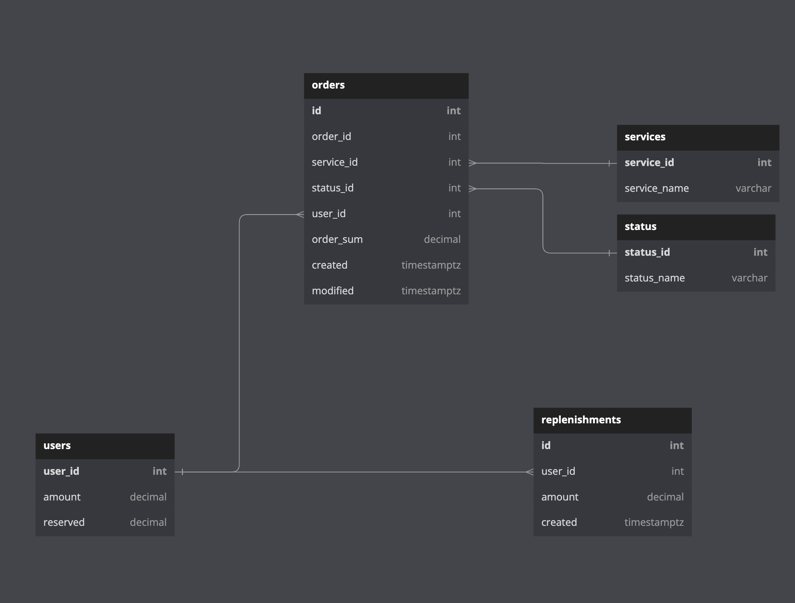

# Balance API
Test task for Avito internship. [Link to task](https://github.com/avito-tech/internship_backend_2022)

## Requirements:
Docker/docker-compose.

## Description:

A small REST service. Providing methods to interact with user's money accounts,
for example crediting and debiting(by creating service order) money, 
getting user's transaction history, getting "income-per-service" report 

## How to start:
```bash
$ make run
```
This command will create two containers:
* PostreSQL on 54320 port
* App on 8080 port


To stop app type:
```bash
$ make stop
```
or
```bash
$ docker-compose down
```
## Supported requests:
```
GET     /user       :   Return user's balance
POST    /user       :   Increase user's money amount
POST    /order      :   Create, approve or cancel order
GET     /history    :   Return list of user's operations
GET     /report     :   Return link for downloading report file
```
For more info see [swagger.yaml](docs/swagger.yaml), [examples](examples.md)
or open ```localhost:8080/swagger/index.html``` when app is running


## Db schema:

I use PostgreSQL as a database in this project.


*Database schema illustration*